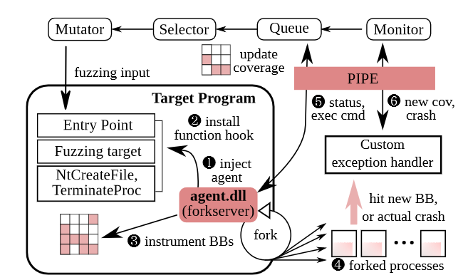

# Winnie-AFL

Winnie-AFL is a fork of WinAFL that supports fuzzing using a fork()-like API. For more details about Winnie, check out the [NDSS paper](https://www.ndss-symposium.org/ndss-paper/winnie-fuzzing-windows-applications-with-harness-synthesis-and-fast-cloning/).


## Project structure

 - afl-fuzz/ -- Main fuzzer code ([WinAFL](https://github.com/googleprojectzero/winafl) fork)
 - forklib/ -- Magic library where the fork() happens.
 - injected-harness/ -- A forkserver and instrumentation agent DLL which gets injected into fuzzing target programs. Communicates with the fuzzer over a named pipe IPC.
 - intel-libipt/ -- Prebuilt binaries for Intel's [libipt](https://github.com/intel/libipt)
 - ipttool/, libipt/ -- Controls the Windows Intel PT driver (forked from [winipt](https://github.com/ionescu007/winipt))
 - wow64ext/ -- Library for interacting with 64-bit address space from 32-bit (WoW64) applications ([forked]((https://github.com/rwfpl/rewolf-wow64ext)))
 - samples/ -- An toy example target application to fuzz with supporting files and harness.
 - experiments/ -- Driver programs for testing individual components of the fuzzer.



## Supported Systems

The fuzzer was tested on Windows 10 x64 1809 17763.973. **Any other configurations should be considered as unsupported.** Notwithstanding that, it probably still works on most 64-bit Windows 10 systems 1809 and up (but no guarantees). Windows 7 isn't supported because of differences in the CSRSS and subsystem implementation.

The fuzzer requires Administrator permissions.

Fuzzer can fuzz both 64-bit and 32-bit applications.

## Building

We try to make the build process as streamlined as possible. Still, you need to prepare the build environment before compiling. You can use Visual Studio 2017 or 2019.

### Generate csrss offsets
The forklib relies on hardcoded offsets that are reverse-engineered from `csrss.dll` and `ntdll.dll`. As you might expect, these offsets vary from system-to-system. **If the offsets are wrong, the fuzzer will not work. You need to regenerate the offsets and recompile for YOUR system.** To generate them:

```bash
cd forklib/
# python3 is not supported. Please use python2
python2 -m pip install construct pefile # get dependencies
python2 ./gen_csrss_offsets.py
cat csrss_offsets.h # check the generated output
```

The script downloads PDBs from Microsoft's symbol servers and parses them to extract the offsets for you automatically.

### Compile

After that everything should "just work", just open the solution in VS2017 and build. VS2019 also should work. You should use the Release configuration builds. The Debug builds are extremely slow as they sacrifice performance for verbosity and debug output.

## Quick-start

For a complete walkthrough, check out the [guide for fuzzing a toy example program](docs/walkthrough.md).

## Usage

Command-line options:

```
Winnie 1.00 -- Forkserver-based Windows fuzzer
Based on WinAFL 1.16b and AFL 2.43b

afl-fuzz [ afl options ] -- [ instrumentation options ] -- [ forkserver options ] -- \path\to\fuzzed_app [ ... ]

Required parameters:

  -i dir        - input directory with test cases
  -o dir        - output directory for fuzzer findings
  -t msec       - timeout for each run

Instrumentation type:

  -P            - use Intel PT tracing mode

Execution control settings:

  -f file       - location read by the fuzzed program (stdin)
  -c cpu        - the CPU to run the fuzzed program

Fuzzing behavior settings:

  -d            - quick & dirty mode (skips deterministic steps)
  -x dir        - optional fuzzer dictionary (see README)

Other stuff:

  -I msec       - forkserver & harness initialization timeout
  -T text       - text banner to show on the screen
  -M \ -S id    - distributed mode (see parallel_fuzzing.txt)

======================================================

Intel PT instrumentation options:

  -m name       - collect coverage for the specified module (required)
                  multiple -m options can be provided
  -trace_size n - trace buffer size in bytes (default: 8M)
  -decoder d    - PT decoding algorithm: 'tip' or 'full_ref'

Fullspeed instrumentation options:

  -bbfile file  - location of basic blocks address list (required)

======================================================

Winnie forkserver options:

  -harness file - location of of harness module dll (required)
  -nofork       - disable fork; use persistent mode
  -minidump_dir - directory to scan for minidumps
  -no_minidumps - disable Windows Error Reporting minidumps
                 (good if the target program crashes frequently during testing)
  -debug        - enable debug mode (increases verbosity)
```

**Remember to configure Windows Error Reporting (WER) using the registry or you may miss crashes.** (See below for more info)

### Example command lines:

**Fork mode with fullspeed instrumentation (recommended):**

`afl-fuzz -i in -o out -t 1000 -I 1000 -- -bbfile basicblocks.bb -- -harness harness.dll -no_minidumps -- toy_example.exe @@`

**Persistent mode with fullspeed instrumentation:**

`afl-fuzz -i in -o out -t 1000 -I 1000 -- -bbfile basicblocks.bb -- -nofork -harness harness.dll -no_minidumps -- toy_example.exe @@`

**Fork mode with Intel PT instrumentation:**

`afl-fuzz -i in -o out -t 1000 -I 1000 -P -- -m toy_example.exe -m example_library.dll -- -harness harness.dll -no_minidumps -- toy_example.exe @@`

## Instrumentation modes

The recommended mode for running Winnie is in **forkserver mode** with **fullspeed instrumentation**; i.e., avoid persistent mode (`-nofork`) and Intel PT (`-P`).

#### Why not Intel PT mode?

The truth is that it sucks so don't use it. Summarily, this is because: (1) WinIPT driver is finnicky and not ideal (2) Trace buffer overflows easily, leading to poor stability (3) The trace packets are an unstoppable deluge that is challenging to process in real-time; i.e., slow.

#### Why not persistent mode?

Poor stability and strict requirements on the fuzzing harness. Unless the target function behaves like a pure function (i.e., no side effects), the program state will change each iteration, eventually leading to divergence. It also suffers from issues such as the target program doing error handling by simply exiting the process, resource leaks, etc. In short, persistent mode is unsuitable for fuzzing closed-source applications, which are predominant on Windows.

## Basic blocks file

Our implementation of fullspeed instrumentation depends on a pre-computed list of basic block addresses that we're interested in collecting coverage for. This is specified with the `-bbfile` instrumentation option. The file format is simple. Each module has a header line `[example.dll]` followed by a list of lines containing `rva,fileoffset`. For example:

```
[whatever.exe]
0x1000,0x400
0x1030,0x430
0x103f,0x43f
0x1048,0x448
[whatever.dll]
0x1000,0x400
0x1052,0x452
0x1064,0x464
0x1075,0x475
```

**It's very important that you don't duplicate basic blocks in the same module, and you don't repeat the same module twice.** We try to detect these cases and generate an error, but be careful.

There are a number of programs to compute a list of basic blocks (IDA Pro, Binary Ninja, etc). **We provide a scripts for Ghirda or IDA Pro to automatically generate a suitable .bb file, see `scripts/`.**

## Minidump crash dumps and exception handling

Windows has some *interesting* error handling mechanisms, some of which are difficult to opt-out of. Winnie uses Win32 exception handling to instrument the target program from within its own address space. These exception handlers are triggered on events such as breakpoints (int 3), access violations (segmentation fault), and so on. This is how we are notified about new coverage or crashes. Thus, it's very important that the Winnie forkserver is able to catch these exceptions so it can handle them properly and update the fuzzer accordingly.

Unfortunately, not all exceptions make it to the unhandled exception filter. Certain crashes (e.g., [stack corruption](https://peteronprogramming.wordpress.com/2016/05/29/crashes-you-cant-handle-easily-1-seh-failure-on-x64-windows/), [heap corruption](https://peteronprogramming.wordpress.com/2017/07/30/crashes-you-cant-handle-easily-3-status_heap_corruption-on-windows/)) just crash the program. Another example is [HeapEnableTerminationOnCorruption](https://docs.microsoft.com/en-us/windows/win32/api/heapapi/nf-heapapi-heapsetinformation), which directly calls Windows Error Reporting (WER) and terminates the process. But if we don't catch or detect these faults, then we would be missing crashes in our fuzzer!

As a last-resort backstop, Winnie relies on WER to catch even these critical errors. We can configure WER (using a registry key) to generate minidumps, and if the target process exits unexpectedly and a crash dump was generated, we know we suffered a serious crash.

By default, crash dumps are generated in %localappdata%\CrashDumps -- and this is the default path Winnie will look for them in. (This search location can be overridden with `-minidump_dir`). **As for configuring WER, you should look at the keys we suggest in `minidump_config.reg`, namely `ForceQueue`, `DontSendAdditionalData`, and `DontShowUI`.**

## Creating a fuzzing harness

The forkserver calls the target's functionality under test through a harness. The harness is a dll specified in the AFL command-line and will get loaded by the fork-server. This harness is essentially responsible for acting as a shim between the forkserver and the target program.

A harness needs to use the `EXPOSE_HARNESS` macro from `harness-api.h` to export the struct `HarnessInfo`. The documentation for this API is located in that header file. This struct describes to the fork-server how to setup the target program and call the target function.

For an example harness, check out the toy example walkthrough.

### Recipes

We include some "recipes" in the forklib for common tasks that can harnesses might want to use to get certain target programs to work properly, such as:

- Manually mark all of the currently open handles as inheritable by the forked child process (`MarkAllHandles`)
- Suspend all of the other running threads (`SuspendOtherThreads`)

Feel free to reuse this code in your harness.

### Example harnesses

There are a few hand-written harnesses for real-world applications included. Check out the `samples/` folder for these examples.

 - Toy example program
 - Source Engine BSP parser (srcds)
 - Derusbi malware (dfb8.dll)

## Troubleshooting

- Try the toy example to make sure nothing is catastrophically wrong first.

- Use `-debug` to enable additional debug messages and more stdio. This is probably very helpful if something is going wrong.

- Use the Debug configuration binaries in conjunction with `-debug`. These builds have much higher verbosity, and always ensure there is a console to output stdio to, at a huge performance cost. (Reopening stdio and allocating new console window is very slow).

- Use fork and fullspeed mode, avoid persistent mode and Intel PT as these are not as robust.

- If the forkserver output scrolls by too fast, set the environment variable AFL_SAME_CONSOLE=1. This will make the forkserver output to the same stdout console as AFL, rather than its own window. Note that this mode *might* have a few of its own bugs/odd cases, though we try our best. You should avoid this unless you really need it to debug. To unset, you can use `set AFL_SAME_CONSOLE=` in cmd.

- Read the section below ("How the target runs under Winnie") and figure things out in a debugger.

## How the target runs under Winnie

This section contains highly technical documentation for anyone who needs to troubleshoot the fuzzer in-depth. Executing the target process has basically 3 main steps:
1. Start process, inject forkserver, and load harness
2. Carefully allow the target to self-initialize
3. Hijack control flow to fork-server fuzzing loop

Here is a explanation of how each of these steps are carried out.

### 1. Process startup, forkserver injection, and harness initialization

Winnie starts the target process suspended, then assembles an infinite loop (EB FE) at the entrypoint then resumes the process until the entrypoint is reached. Since we rely on ordinary CreateRemoteThread+LoadLibrary injection technique, we can't inject the forkserver dll immediately into a suspended process (LoadLibrary will fail). We need to wait for some internal stuff in ntdll, kernelbase, etc. to initialize before the entrypoint is reached. Thus we only inject at the entrypoint. We calculate the entrypoint by parsing the PE header.

Once we inject the forkserver, we need to configure the forkserver with whatever settings AFL was passed. We don't use anything like a config file or a pipe for this, we just directly write the settings struct into the forkserver's memory with WriteProcessMemory. To find the address of the exported settings struct, we parse the PE header exports directory. Before the settings have been written, the forkserver will busy wait on a volatile signal variable. This variable is written to by AFL to let the forkserver know that initialization is done. At this point, AFL waits for the forkserver to finish initializing and create the AFL<-->forkserver named pipe. It will block until the pipe is created and then connect to it.

Meanwhile, the forkserver begins its own initialization. This happens in its  DllMain function, in a separate thread from the main thread. It will create its own console window (if one does not already exist) as well as its own stdio descriptors. Then it loads the user-specified harness DLL. It also uses a similar synchronization mechanism to wait for the harness to initialize: It busy waits on the volatile signal variable `HarnessInfo.ready` exported by the harness DLL. The harness DLL should specify target-specific settings and code like a target function, any setup callbacks, etc.

Once the harness is initialized, the forkserver will hook a bunch of important functions in preparation for step 2 (more details below) and create the AFL<-->forkserver named pipe. It blocks until AFL connects to the newly-created pipe, ending DllMain. At this point, AFL will then resume the main thread (not the DllMain thread), and let the target program self-initialize.

The code for this is in `spawn_child_with_injection` in AFL and `dllmain` in the forkserver.

### 2. Carefully allow the target to self-initialize

During the forkserver initialization, we hooked several key locations. The main goal of this is to breakpoint the execution as soon as the target function is reached. We could do this by simply installing a software breakpoint (i.e., `int 3`) at the target function, but this is not robust as many programs employ self-modifying or self-unpacking code.

To deal with this, we use set a *guard page* (i.e., no rwx; all accesses fault) with VirtualProtect on the target function page. Whenever this page is read, written, or executed, we will receive a page fault in our exception handler. The guard page protection is one-shot, so we need to re-apply it each time. If the fault *is not* execution (i.e., a read or a write), we single step the faulting memory access instruction, reprotect the page, and resume. If the fault *is* execution, we assume that at this point the program's code is unpacked, and at *this* point we hook the target function.

During these early initialization steps, there is a lot that can go wrong. We mainly rely on two key elements: the guard page protection, and the exception handler. First, the guard page could go wrong if the target program changes the memory protection of the page itself. To deal with this, we hook `NtProtectVirtualMemory` to prevent the program from tampering with the guard page. Second, the exception filter may go wrong if the program adds its own exception filter before ours. To deal with this, we hook `RtlAddVectoredExceptionHandler` to make sure our exception handler always is first in the exception handling chain.

### 3. Hijack control flow to fork-server fuzzing loop

Once the target function is reached, it will hit our trampoline. This will jump the excecution back to our forkserver. At this point, we need to carefully save the entire processor state, essentially emulating a context switch. We need to save the current execution context because when we want to call the target function, we obviously need to call it with the right registers, stack pointer, etc. For 32-bit targets we use `pushad`, `pushfd` and `xsave`. For 64-bit targets we use `RtlCaptureContext` (and manually save rcx). We also need to be careful about the target function's calling convention. We also allocate a bunch of empty space on the stack for safety.

Once the context is saved, we get ready for the main forkserver loop. We install all of the coverage instrumentation breakpoints before any forking so we only need to install them once. We also hook functions like `NtCreateFile`, `NtTerminateProcess`, and so on. If the harness wants any setup callback to be run here, we call it. We reconfigure the stdio handles to `nul` if necessary. We enable or disable WER for performance depending on the AFL flags.

Now we enter the main forkserver loop. At this point the forkserver will create another named pipe, this time for the forked child processes. It listens for commands from AFL on the AFL<-->forkserver pipe, such as spawning a new child, and reports back results on the same pipe. In a forked child process, it will context switch back to the previously-captured context we saved earlier, then run the target function. It replaces the return address with one that will report the results to the parent forkserver process through the forkserver<-->child named pipe. Any coverage hit will trigger a breakpoint which is also reported through the forkserver<-->child named pipe.

So overall, the information flows like this: AFL<---pipe--->forkserver<---pipe--->child

The reason that we can't save the context or run the forkserver from another thread is that when we fork, *only the forking thread is cloned*. In other words, calling fork from a different thread will wipe out thread-local storage (TLS) which will lead to incorrect behavior. That's why we need to do the complicated context-switching dance to run the forkserver from the same thread as the target.

The code for this stuff is in `HarnessCallback` in the forkserver.

## Maintainers

- Jinho Jung (@jjung63): harness synthesizer 
- Stephen Tong (@stong): fuzzer and forkserver

As of January 2022, Winnie is no longer actively maintained. We recommend that users fork the project in case that continued development is desired.
