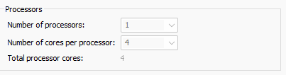
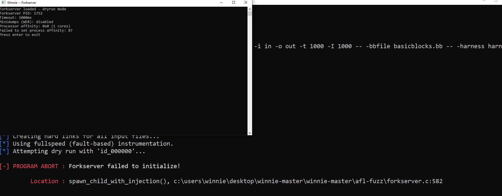
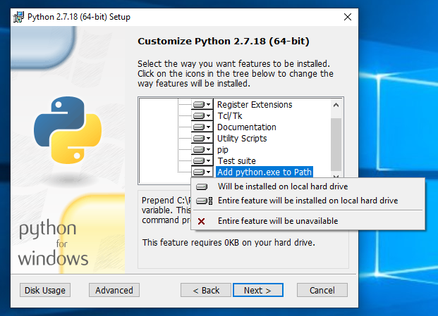
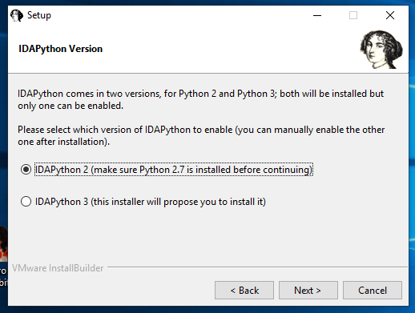
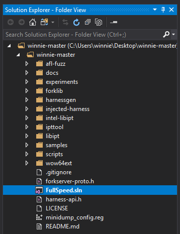
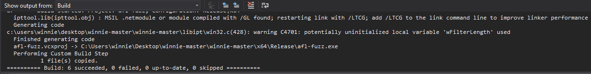
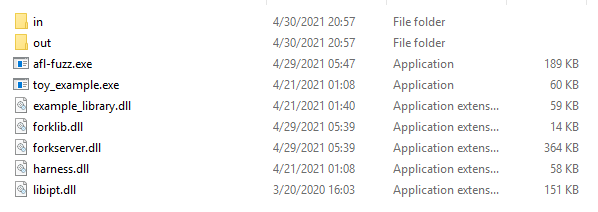

# Complete Walkthrough: Fuzzing Toy Example
This is a complete guide to setting up Winnie, installing required dependencies, and fuzzing the toy example found in `samples/toy_example`. 

## Requirements:
* Visual Studio 2017/2019
* Ida Pro or Ghidra 
* Winnie Code (unzipped to target directory)
* Python 2.7.XX 
* Windows 10 1809/21H2 (1809 preferred)
* Virtual machine or enviroment with *at least* 4 cores per processor
* Windows CMD prompt (DO NOT USE POWERSHELL)
#### NOTE: Winnie only *offically* supports Windows 10 1809, Python 2.7.XX, and Visual Studio 2017. All other configurations are considered unsupported. 

### Step 0: VM Setup: Configure for 4 Cores Per Processer
Winnie requires you to be able to fork different processes, and as such will throw an error if your VM does not have the proper configurations. Make sure you set *at least* 4 cores per processor. The minimum setting are pictured below for VMWare: 



#### NOTE: If you VM is not properly configured, then you will run into the error pictured below. Make sure to reconfigure your VM based on the settings pictured above. 




### Step 1: Install Python 2.7.XX 
Python 2 must be installed *before* installing Winnie and IDA/Ghidra as you may run into pathing issues otherwise. Make sure when installing Python you select to install it to the path OR maunally add it to the path env variable. 
#### NOTE: The default option is to NOT ADD IT TO THE PATH, so make sure to change this. 




### Step 2: Install Ida Pro/Ghidra 
Install Ida Pro/Ghidra for your desired 32/64bit operating system. Please note that Ida Pro requires you install a seperate version for Python 2 and Python 3. Make sure you select the version for Python 2.7. 




### Step 3: Generate csrss offsets
The forklib relies on hardcoded offsets that are reverse-engineered from `csrss.dll` and `ntdll.dll`. As you might expect, these offsets vary from system-to-system. **If the offsets are wrong, the fuzzer will not work. You need to regenerate the offsets and recompile for YOUR system.** To generate them:

```bash
cd forklib/
# python3 is not supported. Please use python2
python2 -m pip install construct pefile # get dependencies
python2 ./gen_csrss_offsets.py
cat csrss_offsets.h # check the generated output
```

The script downloads PDBs from Microsoft's symbol servers and parses them to extract the offsets for you automatically.


### Step 4: Install Visual Studio & Required SDK Dependencies
Visual Studio 2017 is required to build the Winnie and toy example executables. Their are few key SDK's that need to be installed in order to build Winnie and the toy example correctly. 

#### For x64 systems, you need:
    * Workloads: 
        * Desktop Devolopment with C++ 
    * Individual Components:
        * Windows Universal C Runtime
        * Windows 8.1 SDK
        * Windows 10.0.19041 SDK
        * Visual Studio SDK 


### Step 5: Build Winnie: 
First, open the containing folder using File >> open folder. You should have the entire repository pictured in the soultion explorer by default, but can open the soultion explorer via View >> Soultion Explorer.




First, you need to build the Winnie executable. Select the FullSpeed.sln, and set the startup item to be the proper configuration. For our example, we used FullSpeed.sln >> Release|x64:


Start the build process by selecting Build >> Build FullSpeed.sln. You should recieve a success message along the lines of this: 



#### NOTE: If you are recieving errors, you likely have a missing workload or dependency issue. While not all of the SDK's mentioned above are required, they are reccomendded for coverage reasons and simplicity to install. 


### Step 6: Build Toy Example:
Next, you need to perform the same steps as mentioned above, but for the toy example.sln. Set the toy_example.sln to Release|x64 in the aformentioned dropdown.  

 

You should once again recieve a notification


In this guide, I'll explain how to use Winnie to fuzz a toy example program. The code for this guide can be found in `samples/toy_example`. You can build it with Visual Studio. There are 3 projects in the solution:

 - toy_example: this builds the main .exe we will fuzz
 - example_library: this is a .dll containing some buggy functionality that we want to target with our fuzzer
 - harness: this provides a bare-bones example harness to use with Winnie.

To set up the fuzzer, copy the target application (toy_example.exe and example_library.dll) to the Winnie directory (so it's next to afl-fuzz.exe). AFL needs seed inputs, so copy the seed input file (in\input). Lastly, Winnie needs a fuzzing harness to call the target, so copy our fuzzing harness `harness.dll` next to afl-fuzz.exe as well.

At this point, your directory structure should look like this:



Winnie collects coverage using *full-speed* instrumentation. Full-speed instrumentation essentially puts a breakpoint on each basic block. Thus, Winnie needs a list of the addresses of basic blocks we want to cover per module. This list is called the *bb-file* and it's specified with the `-bbfile` parameter. We can automatically generate this file with the IDAPython script `scripts/ida_basic_blocks.py` if you have IDA Pro. (There is also a script for Ghidra.) For more about the bbfile file format, check the README.

At this point, you should also have `basicblocks.bb` in the directory too. Now we can start fuzzing.

`afl-fuzz -i in -o out -t 1000 -I 1000 -- -bbfile basicblocks.bb -- -harness harness.dll -no_minidumps -- toy_example.exe @@`

**Breakdown of the command-line:**

1. `afl-fuzz -i in -o out -t 1000 -I 1000` Standard AFL parameters `-i` and `-o` for input/output dirs, execution timeout (`-t`) of 1000ms, initialization timeout (`-I`) of 1000ms.

2. `--` End of AFL options and start of fullspeed instrumentation options

3. `-bbfile basicblocks.bb` (Required) Use the basic blocks specified in the bbfile `basicblocks.bb`.

4. `--` End of the fullspeed options and start of the forkserver options

5. `-harness harness.dll` (Required) Use our fuzzing harness specific to toy_example.

6. `-no_minidumps` Disable minidumps for speed since toy_example tends to crash a lot during fuzzing. See README for more info.

7. `--` End of forkserver options and start of target argv

8. `toy_example.exe @@` Call toy_example.exe and pass the input filename as argv[1].

### Troubleshooting 

If you encounter errors, check out the README for more info on debugging or make an issue.
